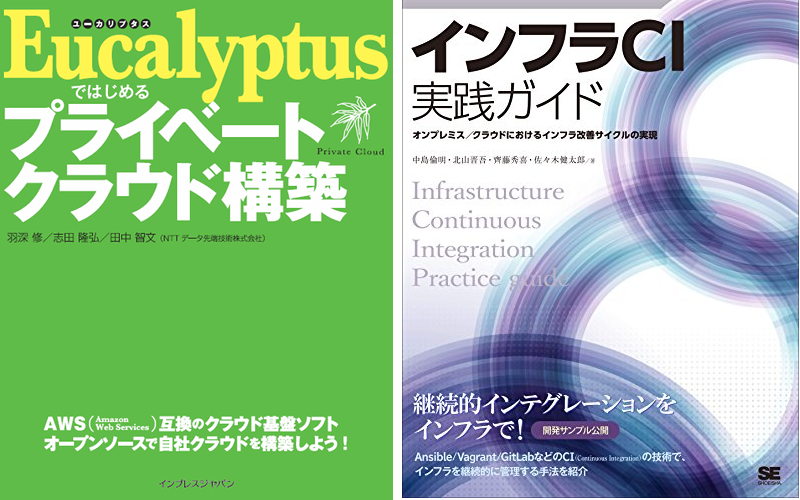
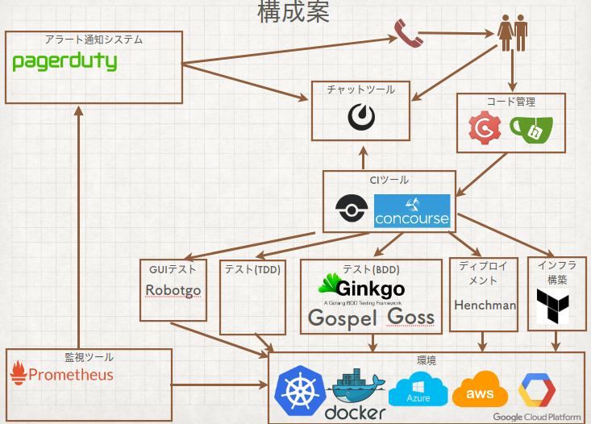
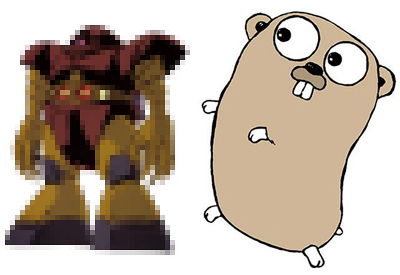

# 僕の考えた最GoのCI環境

author
:   羽深 修

institution
:   伊藤忠テクノソリューションズ株式会社

theme
:   eucalyptusja

date
:   2018/07/29

# 自己紹介

* 羽深 修 (はぶか おさむ)
  * Twitter: habuka036
  * Facebook: osamu.habuka
* 経歴
  * クラウド基盤構築ソフトウェア界隈に生息してまし*た*
    * EucalyptusでLiveDVD芸人
    * Wakame-vdcで茶番リスト
    * OpenStackで鰻師

# 自己紹介

* 羽深 修 (はぶか おさむ)
  * Twitter: habuka036
  * Facebook: osamu.habuka
* 経歴
  * その他、以下の活動をしたり…{::tag name="xx-small"}しなかったり…{:/tag}
    * 日本Henchman使ってみる会
    * 日本goss使ってみる会
    * 日本fission使ってみる会

# 自己紹介

* 本業
  * igniteというサービスを開発&運用しています
    * https://www.ignite.ci
  * DevOpsのコンサルティングおよびCI/CD環境のインテグレーションをしています
  * 同僚がどんなに忙しく仕事してても、ほぼ定時で帰って育児家事を{::tag name="xx-small"}少し{:/tag}してます。

# 自己紹介

* 本業以外
  * 技術系の本を書いたり、大学でもぐりの講師をしたり…
  * {:relative_height="75"}
  * {::wait/} 「インフラCI実践ガイド」は絶賛発売中です！

# はじめに

これは何？

Goで書かれているプロダクトを使ってCI環境を作成しようという話です。

ついでに、YAML大好きっこなので、なるべくYAMLで定義できるように

{::wait/}頑張ろうと思いましたが、ぶっちゃけ酒に溺れてしまい、そこまで到達できませんでした。

# はじめに

どんな構成？こんな構成を夢見ました。

{:relative_height="100"}

# はじめに

Goで書かれているCI環境を構成するプロダクトって何がある？

* Github クローン (俺基準)
  * Gogs
  * Gitea

# はじめに

Goで書かれているCI環境を構成するプロダクトって何がある？

* CI/CD システム (俺基準)
  * Drone
  * Concourse

# はじめに

Goで書かれているCI環境を構成するプロダクトって何がある？

* ディプロイメント (俺基準)
  * Terraform
  * Henchman
    * {::wait/}なんかプロジェクトの活動が止まってるぽくて「Feel free to fork the project」って…

# はじめに

CIと言えばテスト必須

* コードに対するTDD系
  * {::wait/} なんか色々あるっぽいよ？
* コードに対するBDD系 (俺基準)
  * Gingko
  * Gospel
* 環境に関するBDD系 (俺基準)
  * Goss

# はじめに

別になくてもいいけど、あったら便利な周辺環境

* Chat (俺基準)
  * Mattermost
* 監視 (俺基準)
  * Prometheus
* インシデント管理 (俺基準？)
  * PagerDuty を go-pagerduty で…(無理矢理Go感を…

# はじめに

他に気になっているツール類

* GUIテスト
  * Robotgo
* WebUIが素敵そうなテストツール？
  * GoConvey

# はじめに

で、いつものごとく、普段使ってるのはこの中のごく一部です。

# はじめに

このままだと去年の二の舞で、紹介しただけで終わってしまうので、こんな環境を作るためのスクリプト類を置くリポジトリ*だけ*作りました。

[https://github.com/habuka036/gogg](https://github.com/habuka036/gogg)

# はじめに

僕のやる気を刺激するために以下について協力求む… (誰か助けて

* Golang で書かれてるインシデント管理/アラート通知システム
* 絵心ある人、ゴッグと Gopher くんをフュージョンさせて ><

# はじめに

{:relative_height="100"}

# おわりに

ロードマップという名の妄想

* 2018年7月末: GogsとDroneが構築できるスクリプトのリリース
* 2018年8月末: 白紙
* 2018年9月末: 白紙

ずーっと白紙
